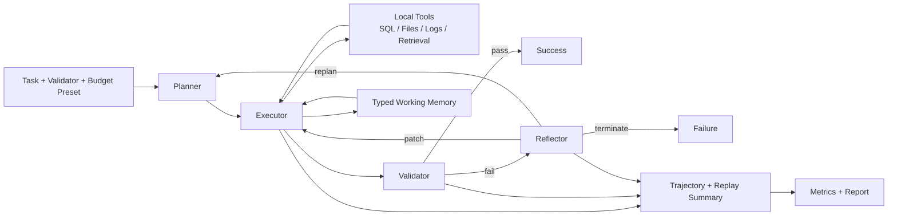

# AutoTool-Agent / AutoToolBench

<p align="center">
  <strong>A local benchmark-oriented runtime for evaluating and improving tool-use agents under structured failure, noisy outputs, and explicit cost constraints.</strong>
</p>

<p align="center">
  <a href="/Users/Hoshino/Downloads/AutoTool-Agent/README.md"></a>
  <a href="/Users/Hoshino/Downloads/AutoTool-Agent/LICENSE"></a>
  <a href="/Users/Hoshino/Downloads/AutoTool-Agent/docs/demo.md"></a>
  <a href="/Users/Hoshino/Downloads/AutoTool-Agent/docs/benchmark_methodology.md"></a>
  <a href="/Users/Hoshino/Downloads/AutoTool-Agent/docs/failure_taxonomy.md"></a>
  <a href="/Users/Hoshino/Downloads/AutoTool-Agent/docs/trajectory_reading_guide.md"></a>
</p>

<p align="center">
  <a href="/Users/Hoshino/Downloads/AutoTool-Agent/docs/demo.md">Minimal Demo</a> ·
  <a href="/Users/Hoshino/Downloads/AutoTool-Agent/docs/one_pager.md">One-Pager</a> ·
  <a href="/Users/Hoshino/Downloads/AutoTool-Agent/docs/benchmark_methodology.md">Methodology</a> ·
  <a href="/Users/Hoshino/Downloads/AutoTool-Agent/docs/failure_taxonomy.md">Failure Taxonomy</a> ·
  <a href="/Users/Hoshino/Downloads/AutoTool-Agent/docs/ablation_guide.md">Ablation Guide</a>
</p>

---

## Overview

AutoTool-Agent is designed for a specific setting: enterprise-style toolchains where an agent must plan, call tools, recover from mistakes, respect budgets, and produce artifacts that are judged by validators instead of by heuristic post-processing.

This project sits between a toy ReAct demo and a heavyweight production agent platform.

| Built for | Not trying to be |
| --- | --- |
| local-first agent runtime experiments | a general-purpose orchestration platform |
| architecture-readable benchmark code | a hosted SaaS agent framework |
| evaluation-driven systems work | a retrieval benchmark with a vector DB backend |
| project portfolio / interview walkthroughs | a full security or permissions system |

## Highlights

| Theme | What it means here |
| --- | --- |
| `Benchmark rigor` | Success comes from execution + validators, not runner heuristics |
| `Recovery` | Failure-aware patch / replan / fail-fast strategies |
| `Memory` | Typed working memory with provenance and replay visibility |
| `Budget` | Calls, steps, runtime, estimated token/tool cost |
| `Retrieval` | Local ranked evidence retrieval without heavy infra |
| `Observability` | Trajectories, replay summaries, markdown reports |

## Quick Links

| I want to... | Start here |
| --- | --- |
| understand the project in 3 minutes | [docs/one_pager.md](/Users/Hoshino/Downloads/AutoTool-Agent/docs/one_pager.md) |
| reproduce a minimal run | [docs/demo.md](/Users/Hoshino/Downloads/AutoTool-Agent/docs/demo.md) |
| run the end-to-end demo script | [scripts/run_minimal_demo.py](/Users/Hoshino/Downloads/AutoTool-Agent/scripts/run_minimal_demo.py) |
| understand benchmark rigor | [docs/benchmark_methodology.md](/Users/Hoshino/Downloads/AutoTool-Agent/docs/benchmark_methodology.md) |
| understand failures and recovery | [docs/failure_taxonomy.md](/Users/Hoshino/Downloads/AutoTool-Agent/docs/failure_taxonomy.md) |
| understand ablations | [docs/ablation_guide.md](/Users/Hoshino/Downloads/AutoTool-Agent/docs/ablation_guide.md) |
| learn how to read trajectories | [docs/trajectory_reading_guide.md](/Users/Hoshino/Downloads/AutoTool-Agent/docs/trajectory_reading_guide.md) |

## Project Meta

| Looking for... | Open |
| --- | --- |
| contribution workflow | [CONTRIBUTING.md](/Users/Hoshino/Downloads/AutoTool-Agent/CONTRIBUTING.md) |
| release history | [CHANGELOG.md](/Users/Hoshino/Downloads/AutoTool-Agent/CHANGELOG.md) |
| near-term direction | [docs/project_roadmap.md](/Users/Hoshino/Downloads/AutoTool-Agent/docs/project_roadmap.md) |
| security contact | [SECURITY.md](/Users/Hoshino/Downloads/AutoTool-Agent/SECURITY.md) |
| license | [LICENSE](/Users/Hoshino/Downloads/AutoTool-Agent/LICENSE) |

## Why This Project Exists

AutoToolBench is most useful when you want to show that you understand more than prompt engineering. The codebase exposes concrete runtime questions:

- How should an agent plan over tools with different costs and risks?
- How do you keep benchmark results tied to real execution and validators?
- How do you represent intermediate state without building an overengineered memory system?
- How do you recover from bad args, wrong tools, missing prerequisites, malformed JSON, and budget exhaustion?
- How do you replay and explain a failure after the run is over?

## Table of Contents

- [Architecture](#architecture)
- [Key Modules](#key-modules)
- [Feature Highlights](#feature-highlights)
- [Benchmark Design](#benchmark-design)
- [Install](#install)
- [Quick Start](#quick-start)
- [Minimal Demo](#minimal-demo)
- [How To Read A Trajectory](#how-to-read-a-trajectory)
- [Suggested Interview Walkthrough](#suggested-interview-walkthrough)
- [Known Limitations](#known-limitations)
- [Additional Docs](#additional-docs)
- [Repository Layout](#repository-layout)

## Architecture



High-level component map:

- `Planner`: produces structured steps, now with optional branch metadata.
- `Executor`: resolves memory, ranks candidate actions, validates arguments, applies safety checks, and runs tools.
- `Reflector`: classifies failures and recommends recovery strategies.
- `BudgetController`: tracks calls, steps, runtime, and estimated token/tool cost.
- `Validators`: decide success from concrete artifacts and structured checks.
- `Eval / Report`: aggregate trajectories into summaries, failure analysis, replay snippets, and markdown reports.

For a one-page interview version, see [docs/one_pager.md](/Users/Hoshino/Downloads/AutoTool-Agent/docs/one_pager.md).

## Key Modules

| Module | Role |
| --- | --- |
| [adaptive_agent.py](/Users/Hoshino/Downloads/AutoTool-Agent/src/autotoolbench/agent/adaptive_agent.py) | Main runtime loop. Coordinates planning, execution, reflection, recovery, branch groups, and finalization. |
| [planner.py](/Users/Hoshino/Downloads/AutoTool-Agent/src/autotoolbench/agent/planner.py) | Produces structured plans with tool-aware hints, memory syntax, and optional branch-group metadata. |
| [executor.py](/Users/Hoshino/Downloads/AutoTool-Agent/src/autotoolbench/agent/executor.py) | Candidate action ranking, argument validation, safety guardrails, tool execution, and memory updates. |
| [reflector.py](/Users/Hoshino/Downloads/AutoTool-Agent/src/autotoolbench/agent/reflector.py) | Maps failures to recovery strategies such as `patch_args`, `replan`, `fail_fast`, and `terminate`. |
| [validators.py](/Users/Hoshino/Downloads/AutoTool-Agent/src/autotoolbench/env/validators.py) | Structured validation with `full_success`, `partial_success`, and `failure`. |
| [runner.py](/Users/Hoshino/Downloads/AutoTool-Agent/src/autotoolbench/eval/runner.py) | End-to-end evaluation orchestration, trajectory persistence, replay summary generation, and scenario summaries. |
| [report.py](/Users/Hoshino/Downloads/AutoTool-Agent/src/autotoolbench/eval/report.py) | Markdown report generation for benchmark, failure, recovery, budget, retrieval, and replay observability. |

## Feature Highlights

### Benchmark rigor

- Success is determined by real execution plus validators.
- Runner-side “policy adjustment” does not overwrite real task success.
- Failure labels, recovery actions, budget usage, and report fields are trajectory-backed.

See [docs/benchmark_methodology.md](/Users/Hoshino/Downloads/AutoTool-Agent/docs/benchmark_methodology.md).

### Failure-aware recovery

- Structured failure labels such as `BAD_TOOL_ARGS`, `MISSING_PREREQUISITE`, `JSON_MALFORMED`, `VALIDATION_FAILED`, and `BUDGET_EXHAUSTED`
- Explicit strategy recommendation instead of a vague “patch or replan”
- Trajectory-backed recovery metadata for replay and metrics

See [docs/failure_taxonomy.md](/Users/Hoshino/Downloads/AutoTool-Agent/docs/failure_taxonomy.md).

### Typed working memory

- Named slots with `value_type`, `source_step_id`, `source_tool`, and `updated_at`
- Compatible `$memory:key` syntax
- Memory provenance in trajectory metadata

### Cost-aware runtime

- Budget controller tracks calls, steps, runtime, estimated tokens, and estimated tool cost
- Candidate action ranking uses likelihood, budget cost, compatibility, and risk
- Recovery metrics expose cost-benefit instead of only success rate

### Lightweight retrieval subsystem

- Ranked local retrieval over reference files
- Retrieval outputs include `source`, `chunk`, `score`, `rank`, and `matched_terms`
- Retrieval quality is summarized in eval reports

### Safety and replay

- Lightweight safety checks for risky writes and non-read-only SQL
- Single-task replay summaries for quick diagnosis
- Markdown reports with failure breakdown, recovery breakdown, budget usage, and representative failure cases

## Benchmark Design

The benchmark is intentionally local and reproducible.

### Task families

- `single_tool_easy`
- `multi_tool_chain`
- `prerequisite_dependency`
- `tool_confusion`
- `args_brittle`
- `budget_tradeoff`
- `retrieval_heavy`
- `ambiguity_heavy`
- `long_horizon`
- `partial_success`

### Stressors

- malformed JSON
- wrong tool choices
- brittle arguments
- missing prerequisites
- empty results
- validator failure
- budget exhaustion

### Evaluation scenarios

- clean runs
- noisy runs
- tight vs loose budget presets
- ablations such as `no_memory` and `weak_validation`

For methodology details, see [docs/benchmark_methodology.md](/Users/Hoshino/Downloads/AutoTool-Agent/docs/benchmark_methodology.md).

## Install

```bash
python -m venv .venv
source .venv/bin/activate
python -m pip install -U pip
python -m pip install -e .[dev]
```

Optional OpenAI backend:

```bash
python -m pip install -e .[openai]
export OPENAI_API_KEY=...
```

## Quick Start

### 1. Generate local benchmark assets

```bash
python -m autotoolbench make-data --seed 0
```

### 2. Run one task

```bash
python -m autotoolbench run \
  --task-id T001 \
  --agent adaptive \
  --seed 0 \
  --noise 0.0 \
  --budget-preset loose \
  --llm mock
```

### 3. Generate a small report

```bash
python -m autotoolbench eval \
  --agent adaptive \
  --seed 0 \
  --noise 0.0
```

Latest report pointers:

- [reports/latest_report.md](/Users/Hoshino/Downloads/AutoTool-Agent/reports/latest_report.md)
- [reports/latest_summary.json](/Users/Hoshino/Downloads/AutoTool-Agent/reports/latest_summary.json)
- [reports/latest_config.json](/Users/Hoshino/Downloads/AutoTool-Agent/reports/latest_config.json)

## Minimal Demo

For a reproducible demo path from data generation to report output:

- [docs/demo.md](/Users/Hoshino/Downloads/AutoTool-Agent/docs/demo.md)
- [scripts/run_minimal_demo.py](/Users/Hoshino/Downloads/AutoTool-Agent/scripts/run_minimal_demo.py)

This is the most useful entry point for interviews, because it gives you:

- one single-task trajectory
- one replay summary
- one markdown report
- a concrete set of generated files you can show live

## How To Read A Trajectory

The fastest way to explain a run is:

1. Read the task header: `task_id`, `task_type`, `budget_mode`
2. Look at each step’s `tool`, `input`, `output`, and `failure_label`
3. Check `recommended_strategy` and `actual_recovery_action` if recovery happened
4. Inspect `memory_delta` and `referenced_memory_keys`
5. Check final `validation`
6. Compare `budget_usage` with task outcome

For a walkthrough-oriented guide, see [docs/trajectory_reading_guide.md](/Users/Hoshino/Downloads/AutoTool-Agent/docs/trajectory_reading_guide.md).

## Suggested Interview Walkthrough

If you only have 5 to 10 minutes, present the project in this order:

1. Problem framing  
   This is a benchmark/runtime for tool-use agents under structured failure, not just prompt quality.
2. Runtime loop  
   Planner -> Executor -> Validator -> Reflector -> Recovery
3. Why it is rigorous  
   Success comes from real execution and validators, not runner heuristics.
4. Why it is interesting  
   It has typed memory, cost-aware execution, failure-aware recovery, retrieval quality, safety, replay, and ablation support.
5. Show one concrete artifact  
   A trajectory JSON, replay summary, or markdown report.

The one-page version is in [docs/one_pager.md](/Users/Hoshino/Downloads/AutoTool-Agent/docs/one_pager.md).

## Known Limitations

- Branch-aware execution is intentionally lightweight and only supports simple independent sibling branches with one merge point.
- Retrieval is local and heuristic-ranked, not embedding-based.
- Token cost is estimated, not tied to real provider billing.
- Safety is lightweight guardrailing, not a complete sandbox or permission model.
- The benchmark focuses on local enterprise-style tool use, not web browsing or long-horizon autonomous internet agents.
- Reports are markdown-first; there is no dedicated UI.

## Additional Docs

- [docs/one_pager.md](/Users/Hoshino/Downloads/AutoTool-Agent/docs/one_pager.md)
- [docs/benchmark_methodology.md](/Users/Hoshino/Downloads/AutoTool-Agent/docs/benchmark_methodology.md)
- [docs/failure_taxonomy.md](/Users/Hoshino/Downloads/AutoTool-Agent/docs/failure_taxonomy.md)
- [docs/ablation_guide.md](/Users/Hoshino/Downloads/AutoTool-Agent/docs/ablation_guide.md)
- [docs/trajectory_reading_guide.md](/Users/Hoshino/Downloads/AutoTool-Agent/docs/trajectory_reading_guide.md)
- [docs/demo.md](/Users/Hoshino/Downloads/AutoTool-Agent/docs/demo.md)
- [docs/project_roadmap.md](/Users/Hoshino/Downloads/AutoTool-Agent/docs/project_roadmap.md)
- [CONTRIBUTING.md](/Users/Hoshino/Downloads/AutoTool-Agent/CONTRIBUTING.md)
- [CHANGELOG.md](/Users/Hoshino/Downloads/AutoTool-Agent/CHANGELOG.md)

## Repository Layout

```text
src/autotoolbench/agent      planner / executor / reflector / budget / schema
src/autotoolbench/env        tasks and validators
src/autotoolbench/tools      local tool implementations and schema
src/autotoolbench/eval       runner / metrics / report / replay
src/autotoolbench/retrieval  lightweight ranked local retrieval
docs/                        interview-facing and methodology documents
scripts/                     small runnable helpers and demo scripts
tests/                       regression and behavior coverage
```
